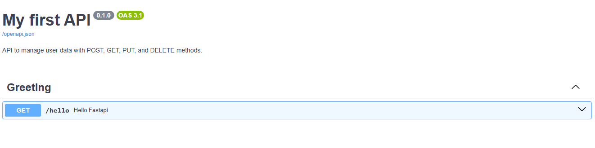

# Creating first API and running the API using GitHub Codespaces

## 1. Create `first_api.py` in GitHub Codespaces and write the code below

```python
from fastapi import FastAPI

# Initialize FastAPI app
app = FastAPI(
    title="My first API",
    description="API to manage user data with POST, GET, PUT, and DELETE methods.",
    version="0.1.0",
)

@app.get("/hello", tags=["Greeting"])
def hello_fastapi():
    return {"message": "Hello, FastAPI!"}

```

## 2.  Install the required dependencies by running these commands in your terminal 


| Command              | Description                                      |
|----------------------|--------------------------------------------------|
| **pip install fastapi** | Installs the FastAPI framework                  |
| **pip install uvicorn** | Installs the ASGI server needed to run FastAPI |

## 3.  Start your application by running the command 
```bash
 uvicorn main:app --reload
```
> **Note:** The `--reload` flag enables auto-reloading whenever you make changes to your code.


## 4. Open a browser (e.g., Chrome) and access the Swagger UI for your API

   - Example Codespaces URI:  
     > **https://jubilant-xylophone-jjgp646x9qpj3pw9w.github.dev/**

   - Append **`-8000.app`** and **`/docs`** to the above URI.  
     Final Swagger URI will be:  
     > **https://jubilant-xylophone-jjgp646x9qpj3pw9w-8000.app.github.dev/docs**

## 5. Open the final Swagger URI in your browser  
   The Swagger UI should look like the sample below:



In the above Swagger UI screenshot, the **green badge "OAS 3.1"** means:

1. OAS = OpenAPI Specification  
2. 3.1 = the version of the OpenAPI Specification this API documentation is using  
3. Swagger UI shows this badge to confirm the schema (openapi.json) complies with OpenAPI 3.1
